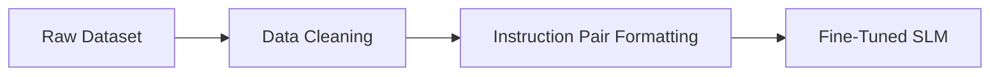
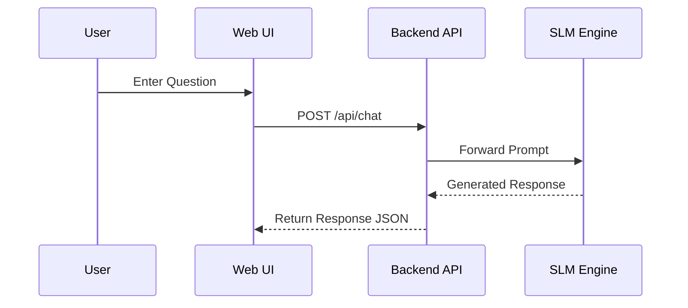

# Diagrams

Use Mermaid.js for inline technical diagrams.

## Flowchart Example

```mermaid
flowchart LR
    A[Raw Dataset] --> B[Data Cleaning]
    B --> C[Instruction Pair Formatting]
    C --> D[Fine-Tuned SLM]
```

## Sequence Example

```mermaid
sequenceDiagram
    User->>Web UI: Enter Question
    Web UI->>Backend API: POST /api/chat
    Backend API->>SLM Engine: Forward Prompt
    SLM Engine-->>Backend API: Generated Response
    Backend API-->>Web UI: Return Response JSON
```
