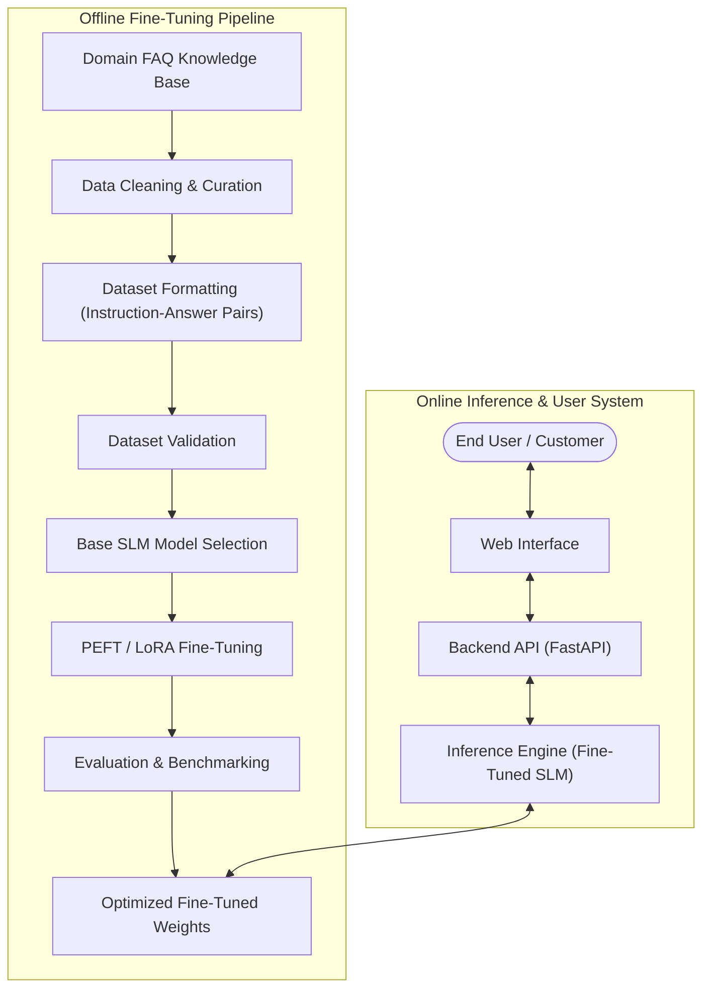

# Home / Project Overview

Welcome to the official visual technical documentation portal for **Domain FAQ Support Chatbot Using Fine Tuned Small Language Models**.

---

## 🛡️ Project Status & Technology Badges

### Project

### AI & Machine Learning

### Application & Infrastructure

---

## 📌 Problem Statement

Customer support and internal domain guidance often rely on repetitive manual responses or rigid keyword-based FAQ systems that fail to understand natural language variations.

While Large Language Models (LLMs) offer strong conversational reasoning, deploying massive models for narrow domain FAQs is computationally expensive, latency-heavy, and poses privacy concerns.

**The Challenge:**
1. High operational costs associated with proprietary LLM APIs.
2. Domain domain-specific terminology misalignment in generic off-the-shelf models.
3. Need for predictable, highly accurate domain answers without hallucinating unsupported policies.

---

## 💡 High-Level Solution

This project builds a specialized, efficient **Domain FAQ Support Chatbot** leveraging **Fine-Tuned Small Language Models (SLMs)**.

By fine-tuning parameter-efficient open SLMs (such as LLaMA/Qwen/Phi variants via PEFT/LoRA/QLoRA) on curated domain FAQ paired datasets:
- **Low Latency & High Speed:** Runs efficiently on modest hardware or edge instances.
- **Precision Responses:** Tailored to strict domain knowledge bases.
- **Cost Effective:** Low inference costs compared to general-purpose cloud LLMs.

---

## 🏗️ System Architecture

The project decouples offline training from real-time online inference:

---

## 🔬 Core Focus Areas

- **Dataset Construction:** Scraped, cleaned, and formatted domain-specific FAQ pairs with strict validation.
- **Fine-Tuning Methodology:** Quantized parameter-efficient fine-tuning (QLoRA) maximizing domain accuracy while keeping resource overhead minimal.
- **Evaluation Framework:** Multi-metric evaluation checking exact factual recall, response relevance, and hallucination bounds.
- **Deployment & Web Integration:** Modular FastAPI backend serving a lightweight, modern web frontend.

---

## 👥 Team Overview

The project is developed by a dedicated 3-member engineering team:

| Team Member | Primary Focus Areas |
| :--- | :--- |
| **Member 1** | Data Pipeline, Data Cleaning & FAQ Formatting |
| **Member 2** | SLM Selection, PEFT/LoRA Fine-Tuning & Model Evaluation |
| **Member 3** | Backend API, System Architecture & Web UI Integration |

---

## 🚀 Navigation Quick Links

- Explore ongoing technical documentation in the **[Development Workspace](development/index.md)**.
- Read website contributor guides in **[For the Devs](for-the-devs/getting-started.md)**.
- View website updates in the **[Documentation Changelog](for-the-devs/changelog.md)**.
- Inspect the source code on **[GitHub Repository](https://github.com/rbijo/dfcs.docs)**.
